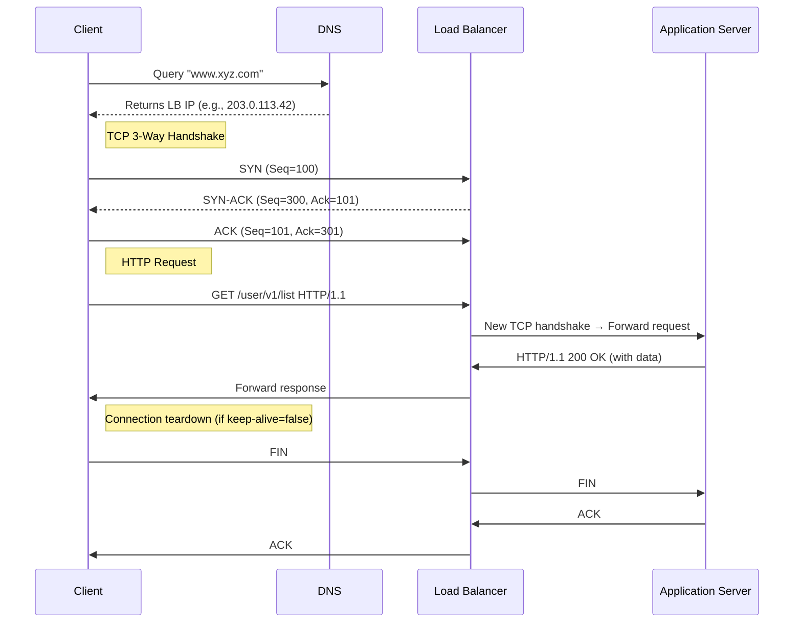

# HTTP Request Flow: From Client to Server and Back

This document explains the complete journey of an HTTP request through various system components.

## Architecture Overview
[Client] → DNS → TCP Handshake → HTTP Request → Load Balancer → Web Server → App Server →
Database → App Server → Web Server → Load Balancer → HTTP Response → [Client]


## HTTP Server Components

### Network Layer
- **Port Listening**:
  - HTTP: 80
  - HTTPS: 443
- **Protocol Handling**:
  - Manages TCP/IP connections
  - Handles socket management

### Request Parser
Extracts:
- HTTP Method: [POST, PUT, GET, DELETE, OPTIONS, PATCH]
- URI
- Headers
- Body
- Query Parameters

### Routing Mechanism
- Static URL routing
- RESTful API routing

### Response Generator
- Status codes
- Response Body:
  - Success
  - Failure

### Concurrency Model
- Multi-threading
- Connection pooling

## Sequence Diagram


## HTTP Request Flow

```text
1. Client Request
   │
   ▼
2. DNS Resolution
   │  www.xyz.com → 13.224.158.186 (Load Balancer IP)
   │
   ▼
3. TCP 3-Way Handshake
   │  Client              Load Balancer
   │    │───SYN───────▶│
   │    │◀──SYN-ACK───│
   │    │───ACK───────▶│
   │
   ▼
4. Load Balancer Processing
   │  • Health checks
   │  • Routing algorithm
   │  • Backend selection
   │
   ▼
5. Application Processing
   │  • New TCP connection
   │  • Request forwarding
   │  • Business logic
   │  • Database queries
   │
   ▼
6. Response Return
   │  App Server → Load Balancer → Client
   │
   ▼
7. Connection Termination
   │  (If keep-alive=false)
